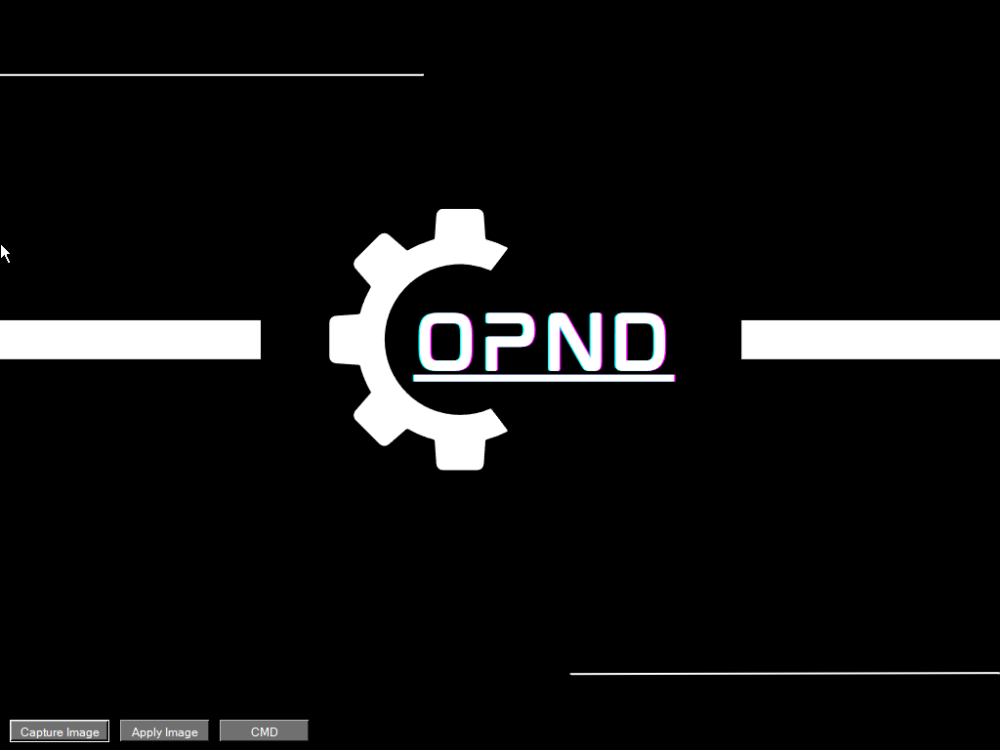

# OPNDeploy - Revolutionizing Windows Imaging

OPNDeploy is an innovative, open-source solution designed to streamline the process of creating, customizing, and deploying Windows images. With a user-friendly interface and a powerful feature set, OPNDeploy is the ultimate tool for both beginners and experts looking to tailor their Windows installations to their specific needs.

## Features

- User-friendly interface for easy navigation
- Support for various Windows versions and editions
- Driver integration and application management
- Streamlined system configuration and customization
- Active development and support from a dedicated community

## Getting Started

To get started with OPNDeploy, follow these steps:

1. Clone the repository or download the latest release from the [Releases page](https://github.com/LordMordon/OPNDeploy/releases).

git clone https://github.com/LordMordon/OPNDeploy.git

2. Follow the [installation guide](./INSTALL.md) to set up OPNDeploy on your system.

3. Refer to the [documentation](./DOCS.md) for detailed instructions on using OPNDeploy, including basic usage and advanced customization techniques.

## Contributing

We welcome contributions from users like you! If you'd like to contribute to OPNDeploy, please follow these steps:

1. Fork the repository on GitHub.

2. Create a new branch for your changes.

3. Make your changes and commit them to your branch.

4. Submit a pull request with a description of your changes.

For more information, please refer to the [contributing guide](./CONTRIBUTING.md).

## Support

If you need help with OPNDeploy, please check out the following resources:

- [Documentation](./DOCS.md)
- [Website](https://opndeploy.com)
- [Issue Tracker](https://github.com/LordMordon/OPNDeploy/issues)

## License

OPNDeploy is released under the [MIT License](./LICENSE).

## Connect with Us

- [Twitter](https://twitter.com/OPNDeploy)
- [Facebook](https://www.facebook.com/people/Morgan-Opndeployment/pfbid0Tor2sRNoYiLgSLka333EGeS25r66ZgNjYsnYuMWRocq4iSTkknzWrHTjrzyEqyvBl/)
